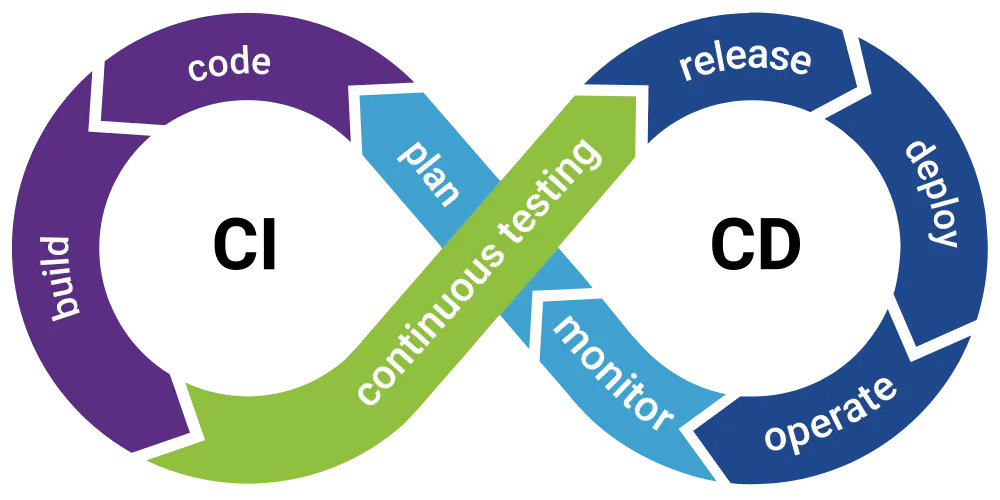

# The DevOps Guide

## What is DevOps?

DevOps is a movement and a culture before being a job this is why cultural aspects are very important. DevOps is all about getting your solutions to run efficiently from deployment to updates.
The two groups, operations and development are converged into a single group where the engineers work across the whole SDLC(Software Development Life Cycle).
The development team that develops the plan, designs and builds the system from scratch and the operation team for testing and implementation of whatever is developed. The operations team gave the development team feedback on any bugs that needed fixing and any rework required. Invariably, the development team would be idle awaiting feedback from the operations team. This undoubtedly extended timelines and delayed the entire software development cycle. There would be instances where the development team moves on to the next project while the operations team continues to provide feedback for the previous code. This meant weeks or even months for the project to be closed and final code to be developed. Now, what if the two departments came together and worked in collaboration with each other?

What if the wall of confusion was broken and this is called the DevOps approach? The DevOps symbol resembles an Infinity sign, suggesting that it is a continuous process of improving efficiency and constant activity.

The DevOps approach makes companies adapt faster to updates and development changes. The teams can now deliver quickly and the deployments are more consistent and smooth, though there may be communication challenges, DevOps manages a streamlined flow between the teams and makes the software development process successful.

So in simpler terms, DevOps is a set of practices to build, test and release your code in small, frequent steps.

For reference, this is the definition of DevOps by [AWS](https://aws.amazon.com/devops/what-is-devops/):
> DevOps is the combination of cultural philosophies, practices, and tools that increases an organization’s ability to deliver applications and services at high velocity: evolving and improving products at a faster pace than organizations using traditional software development and infrastructure management processes. This speed enables organizations to better serve their customers and compete more effectively in the market.

You can also read on what Microsoft thinks DevOps is?
 [Microsoft - What is DevOps](https://azure.microsoft.com/overview/what-is-devops/#overview)

## How this Guide works

We have some sections which covers fundamentals of DevOps like:

- Continuous integration and continuous deployment (CI/CD)
- Version Control System (VCS)
- Infrastructure as Code (IaC)

## Resources

| Practice                                                            | Tool                                                                                       |
| :------------------------------------------------------------------ | :----------------------------------------------------------------------------------------- |
| [Rishab's DevOps Series](https://youtube.com/playlist?list=PLK_LRl1CH4L9ZI0N6WqmQE-Y_-lflAbqM)| Explanation on some of the fundamentals concepts of DevOps.
| [Learn GitHub Actions](https://docs.github.com/en/actions/learn-github-actions)| This guide will help you use GitHub Actions to accelerate your application development workflows.
| [HashiCorp Learn](https://learn.hashicorp.com/terraform)| Build, change, and destroy infrastructure with Terraform. Start here to learn the basics of Terraform with your favorite cloud provider.
| [FreeCodeCamp DevOps Engineering Course](https://youtu.be/j5Zsa_eOXeY) | Learn all about DevOps in this comprehensive course for beginners with three technical tutorials.
| [Docker](https://youtu.be/3c-iBn73dDE) | Complete Docker Hands-on course with a lot of demos and explaining the concepts behind, so that you really understand it.
| [Docker and Kubernetes](https://youtu.be/Wf2eSG3owoA) | Learn the fundamentals of Docker and Kubernetes in this complete hand-on course.
| [Prometheus](https://youtube.com/playlist?list=PLy7NrYWoggjxCF3av5JKwyG7FFF9eLeL4) | Complete Prometheus Monitoring Tutorial

## Key learnings

- Why each one matters.
- What each one accomplishes.
- Most popular tools for each practice.
- Hands on experience with
  - CI/CD
  - IaC
  - Version control
- An understanding for infrastructure and application monitoring and the basic ideas of logs, metrics, traces

## Certifications

- [AWS Certified DevOps Engineer - Professional](https://aws.amazon.com/certification/certified-devops-engineer-professional/?ch=sec&sec=rmg&d=1)
- [Microsoft Certified: DevOps Engineer Expert](https://docs.microsoft.com/en-us/learn/certifications/devops-engineer/)
