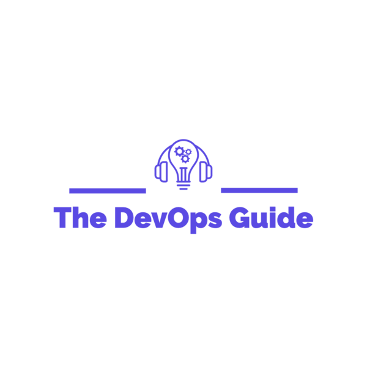

<!-- _coverpage.md -->

> A guide to DevOps

- Built for the community
- Free and Open Source
- Resources, tasks, and projects

built with ❤️ by [Rishab](https://twitter.com/rishabincloud)

[GitHub](https://github.com/rishabkumar7/the-devops-guide/)
