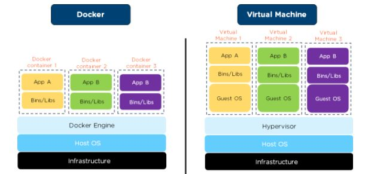

# Containerization

## What is Containerization?

Containerization is the packaging of software code with just the operating system (OS) libraries and dependencies required to run the code to create a single lightweight executable—called a container, that runs consistently on any infrastructure. More portable and resource-efficient than virtual machines (VMs). They have become the de facto compute units of modern cloud-native applications.

## What is Docker?

Docker is a computer program that performs operating-system-level virtualization, also known as "containerization". It is a tool which helps to containerize an application. Containers could be as low as 50MB.

Basic Design:
Hardware --> Operating System --> Container Engine --> Bins/Libs --> App1 --> Bins/Libs --> App2 --> Bins/Libs --> App3

### Resources for Docker

| Resource | Notes |
| --- | ----------- |
| [Docker Tutorial for Beginners](https://youtu.be/3c-iBn73dDE) | TechWorld with Nana with a tutorial again! By the end, you will have a deep understanding of the concepts and a great overall big picture of how Docker is used in the whole software development process. |
| [Learn Docker in 7 Easy Steps](<https://youtu.be/gAkwW2tuIqE>) | Fireship - A complete introduction to Docker. Learn how to Dockerize a Node.js and run manage multiple containers with Docker Compose. |
| [Docker 101](https://www.docker.com/101-tutorial/) | Learn how to build and share a containerized app |

## What is Kubernetes?

Here is how RedHat defines Kubernetes:
> “Kubernetes (also known as k8s or “kube”) is an open source container orchestration platform that automates many of the manual processes involved in deploying, managing, and scaling containerized applications.”

In other words, you can cluster together groups of hosts running containers, and Kubernetes helps you easily manage those clusters.
And you might be asking but what is container orchestration?
Container orchestration is about managing the lifecycle of containers, particularly in large, dynamic environments. It automates the deployment, networking, scaling, and availability of containerized workloads and services. Running containers - which are lightweight and usually ephemeral by nature - in small numbers, is easy enough to be done manually. However, managing them at scale in production environments can be a significant challenge without the automation that container orchestration platforms offer. Kubernetes has become the standard for container orchestration in the enterprise world.

### Resources for Kubernetes

| Resource | Notes |
| --- | ----------- |
| [An Introduction to Kubernetes](https://www.digitalocean.com/community/tutorials/an-introduction-to-kubernetes) | DigitalOcean with a great intro to Kubernetes |
| [Kubernetes Tutorial for Beginners](https://youtu.be/X48VuDVv0do) | Full Kubernetes Tutorial from Nana, hands-on course with a lot of demos  |
| [Kubernetes The Hard Way](https://github.com/kelseyhightower/kubernetes-the-hard-way) | Kubernetes The Hard Way, by Kelsey Hightower, is optimized for learning, which means taking the long route to ensure you understand each task required to bootstrap a Kubernetes cluster. |
